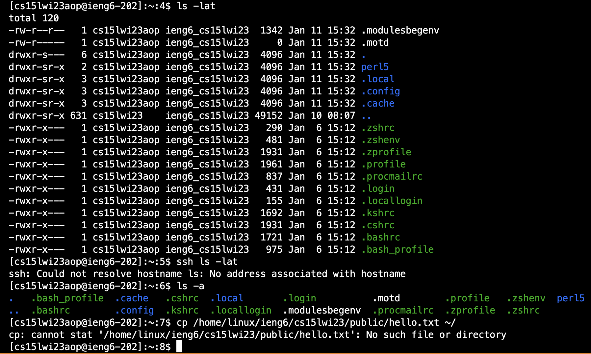

# Installing VScode
* To install VScode, go to the Visual Studio Code website [Link](https://code.visualstudio.com/), and follow the instructions to download and install it on your computer. I did the version of operating systems with macOS (for Macs).
* After installed, go to VScode to open a window that looks like below. The system color and theme might be different, which would be fine. Mines is already installed before, so it would be slightly different.

# Remotely Connecting
Here we would use VScode to connect to a remote computer over the Internet to do work there.
* For Windows user, you first need to install git.
 1. Open Visual Studio Code and use the Terminal -> New Terminal menu to open the terminal.
 2. Open the command using ctrl + shift + P.
 3. Select Default Profile and select Git Bash from the options and then click on the + icon in the terminal window.
 4. The new terminal now will be a Git Bash terminal.
* Then, to use ssh, open a terminal in VScode. Use the command `$ ssh cs15lwi23zz@ieng6.ucsd.edu`. "zz" should be replaced with the letter that everyone have a unique course-specific account. To connect remotely, you will need to find your own course-specific account, which can be found by this website [Link](https://sdacs.ucsd.edu/~icc/index.php) and reset your password. 
* If it's the first time you’ve connected to this server, you will probably get a message saying authenticity can't be established. Just type `yes` and press Enter, and then type in your password for this account. Now if you're logged in, you would see things as below:

 
# Trying Some Commands
Now try running some commands both on your computer, and on the remote computer (following after ssh by using the terminal in VScode).
* You can use commands such as `cd` `ls` `pwd` `mkdir` `cp`, a few times in different ways.
 1. cd - switch the current working directory to the given path
 2. ls - lists the files and folders for the given path
 3. pwd - prints the current working directory
 4. mkdir - makes a new directory
 5. cp - create a copy of the contents of the file
* Here I used `ls -lat` `ssh ls -lat` `ls -a`, and below would be my results of what I typed in.
* Finally, to log out of the remote server in your terminal, you could use either Ctrl-D or run the command `exit`.

