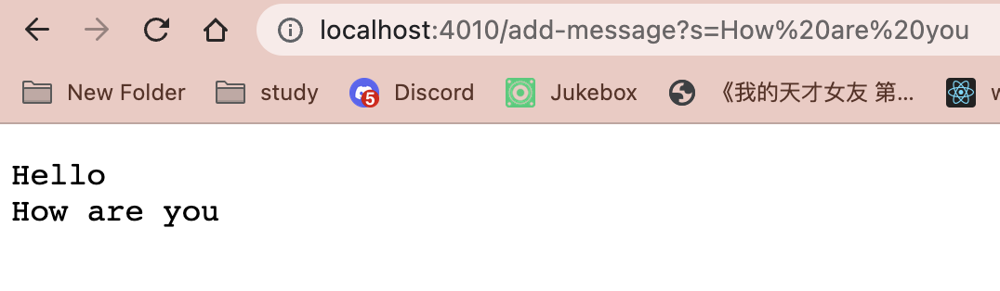
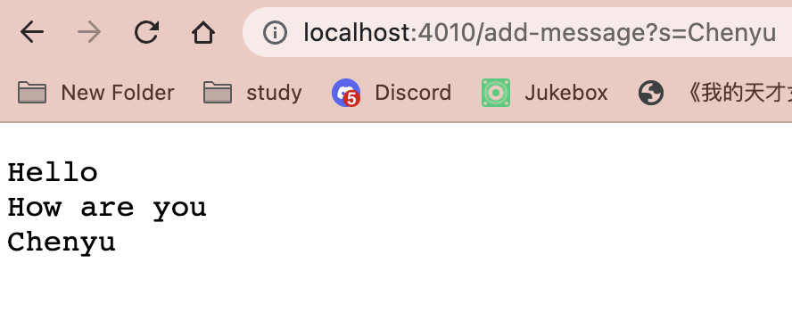
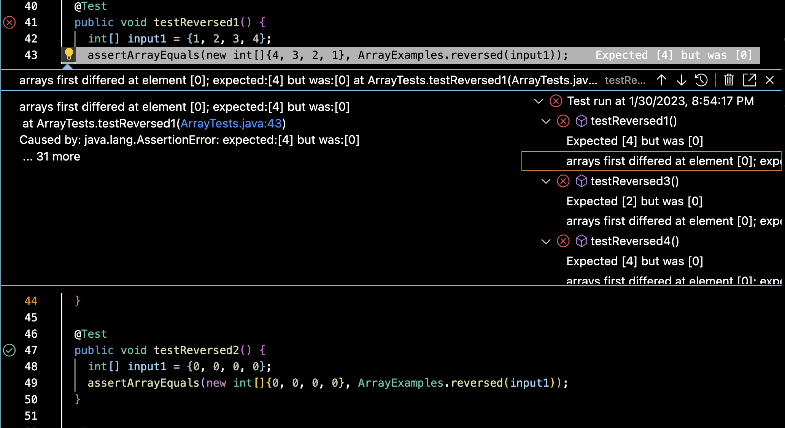

# Part1
My code StringServer:
```
import java.io.IOException;
import java.net.URI;

class Handler implements URLHandler {

    private String concatenatedString = "";

    public String handleRequest(URI url) {
            System.out.println("Path: " + url.getPath());
            if (url.getPath().contains("/add-message")) {
                String[] parameters = url.getQuery().split("=");
                if (parameters[0].equals("s")) {
                        concatenatedString += parameters[1] + "\n";
                        return concatenatedString;
                }
            }
            return "Invalid input!";

        }
}

class StringServer {
    public static void main(String[] args) throws IOException {
        if(args.length == 0){
            System.out.println("Missing port number! Try any number between 1024 to 49151");
            return;
        }

        int port = Integer.parseInt(args[0]);

        Server.start(port, new Handler());
    }
}
```


* Which methods in your code are called: I called the main method and the handleRequest method.
* What are the relevant arguments to those methods, and the values of any relevant fields of the class: The relevant argument to the main method includes when there's no port number and when there is port number (for port numbers, they're unique numbers assigned that is used to exchange formation between a web server and a web client) then we should call the server to inplement the handleRequest method, (handleRequest uses the URI built-in and its methods, getPath() and getQuery() to parse URL parts, print them out, and includes them in conditionals to determine browser behavior) and the relevant argument to that method includes checking if the url contains "/add-message". The relevant value would be the string array called parameters. The values would get changed.
* How do the values of any relevant fields of the class change from this specific request? If no values got changed, explain why: values of the parameters string array and the string array args got changed. parameters got changed and it now contains "s", "hello", "how are you". args now contains "4010".


* Which methods in your code are called: the main method and the handleRequest method are called.
* What are the relevant arguments to those methods, and the values of any relevant fields of the class: First, it checks in the main method to see if the args is empty, if it's empty then print the "missing port number" message, otherwise the handleRequest method is called. If url's path doesn't contain "/add-message", then the "Invalid input!" is returned. The relevant values would be the url, args and parameters.
* How do the values of any relevant fields of the class change from this specific request? If no values got changed, explain why: values of the parameters string array got changed. The values of the string array args stay the same, same as "4010" since I didn't change the port. But the parameters got changed and it now contains one more "Chenyu".

# Part2
* A failure-inducing input for the buggy program, as a JUnit test and any associated code:
```
@Test
  public void testReversed1() {
    int[] input1 = {1, 2, 3, 4};
    assertArrayEquals(new int[]{4, 3, 2, 1}, ArrayExamples.reversed(input1));
  }
```
* An input that doesn’t induce a failure, as a JUnit test and any associated code:
```
@Test
  public void testReversed2() {
    int[] input1 = {0, 0, 0, 0};
    assertArrayEquals(new int[]{0, 0, 0, 0}, ArrayExamples.reversed(input1));
  }
```
* The symptom, as the output of running the tests: The symptom tested for the testReversed1 method was “arrays first differed at element [0]; expected:<4> but was:<0>”

* The bug, as the before-and-after code change required to fix it: 

before:
```
static int[] reversed(int[] arr) {
    int[] newArray = new int[arr.length];
    for(int i = 0; i < arr.length; i += 1) {
      arr[i] = newArray[arr.length - i - 1];
    }
    return arr;
  }
```
after:
```
static int[] reversed(int[] arr) {
    int[] newArray = new int[arr.length];
    for(int i = 0; i < arr.length; i += 1) {
      newArray[i] = arr[arr.length - i - 1];
    }
    return newArray;
  }
```
* Briefly describe why the fix addresses the issue: first I switched the left hand side and right hand side of the assignment so that the values in arr are assigned to the newArray in reverse order. Then I changed the return statement to make it return the newArray instead of arr. 
 
# Part3
The most important thing I learned is definitely writing the tester. It's really useful and necessary to see if there's any mistake on my code and why is that. Second thing is the URLHandler Interface and biuld URLs with paths and queries on the running server, though I still can't be sure how this exactly works and if I could do the codes right, but I have a much deeper understaning with the getquery() and split to check the parameter array index's value, and thus do the number increment or string printing. Also, using git and bash to connect to remote server and run on it.
