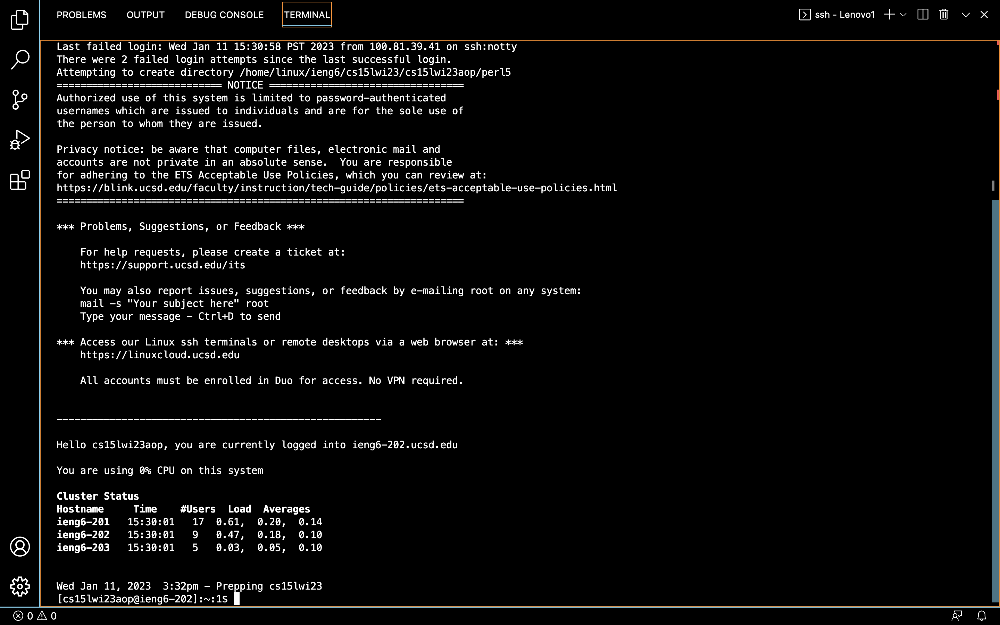
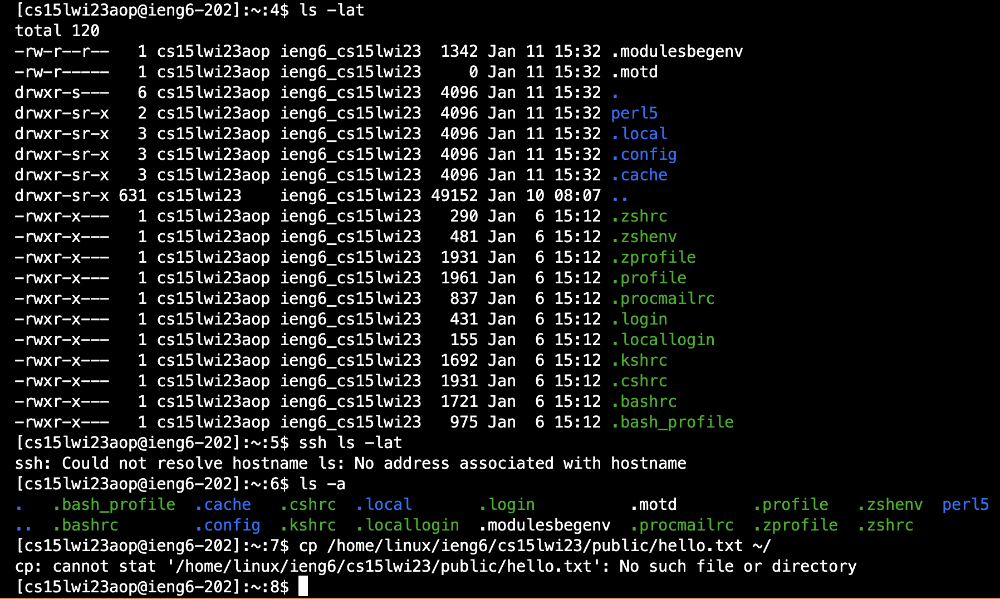

# Part1
My code StringServer:
```
import java.io.IOException;
import java.net.URI;

class Handler implements URLHandler {
    // The one bit of state on the server: a number that will be manipulated by
    // various requests.
    private String concatenatedString = "";

    public String handleRequest(URI url) {
            System.out.println("Path: " + url.getPath());
            if (url.getPath().contains("/add-message")) {
                String[] parameters = url.getQuery().split("=");
                if (parameters[0].equals("s")) {
                        concatenatedString += parameters[1] + "\n";
                        return concatenatedString;
                }
            }
            return "Invalid input!";

        }
}

class StringServer {
    public static void main(String[] args) throws IOException {
        if(args.length == 0){
            System.out.println("Missing port number! Try any number between 1024 to 49151");
            return;
        }

        int port = Integer.parseInt(args[0]);

        Server.start(port, new Handler());
    }
}
```


* Which methods in your code are called: I called the main method and the handleRequest method.
* What are the relevant arguments to those methods, and the values of any relevant fields of the class: The relevant argument to the main method includes when there's no port number and when there is port number then we should call the server to inplement the handleRequest method, and the relevant argument to that method includes checking if the url contains "/add-message". The relevant value would be the string array called parameters. The values would get changed.
* How do the values of any relevant fields of the class change from this specific request? If no values got changed, explain why: values of the parameters string array and the string array args got changed. parameters got changed and it now contains "s", "hello", "how are you". args now contains "4010".


* Which methods in your code are called: the main method and the handleRequest method are called.
* What are the relevant arguments to those methods, and the values of any relevant fields of the class: First, it checks in the main method to see if the args is empty, if it's empty then print the "missing port number" message, otherwise the handleRequest method is called. If url's path doesn't contain "/add-message", then the "Invalid input!" is returned. The relevant values would be the url, args and parameters.
* How do the values of any relevant fields of the class change from this specific request? If no values got changed, explain why: values of the parameters string array got changed. The values of the string array args stay the same, same as "4010" since I didn't change the port. But the got changed and it now contains "s", "hello", "how are you" and "Chenyu".

# Part2
* A failure-inducing input for the buggy program, as a JUnit test and any associated code:
* An input that doesn’t induce a failure, as a JUnit test and any associated code:
* The symptom, as the output of running the tests:
* The bug, as the before-and-after code change required to fix it:

 
# Part3
Now try running some commands both on your computer, and on the remote computer (following after ssh by using the terminal in VScode).
* You can use commands such as `cd` `ls` `pwd` `mkdir` `cp`, a few times in different ways.
 1. cd - switch the current working directory to the given path
 2. ls - lists the files and folders for the given path
 3. pwd - prints the current working directory
 4. mkdir - makes a new directory
 5. cp - create a copy of the contents of the file
* Here I used `ls -lat` `ssh ls -lat` `ls -a`, and below would be my results of what I typed in.
* Finally, to log out of the remote server in your terminal, you could use either Ctrl-D or run the command `exit`.

