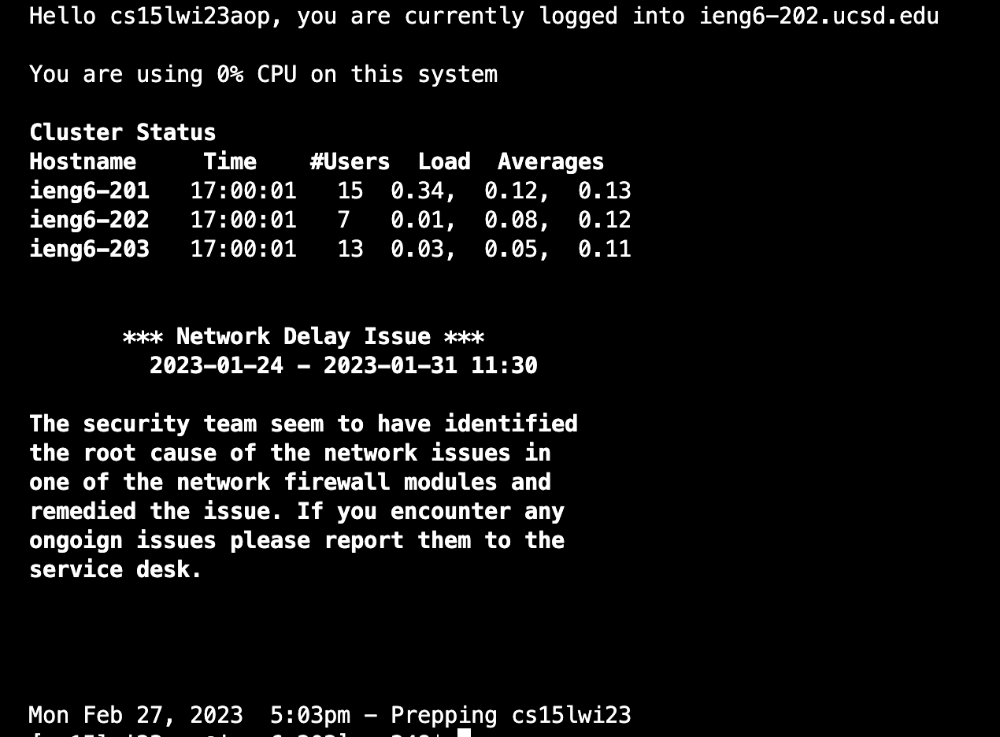
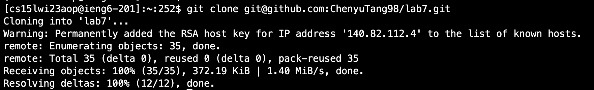
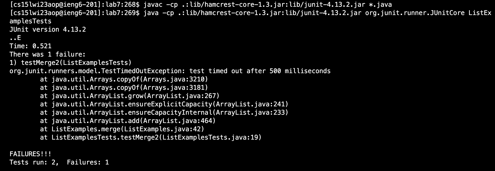
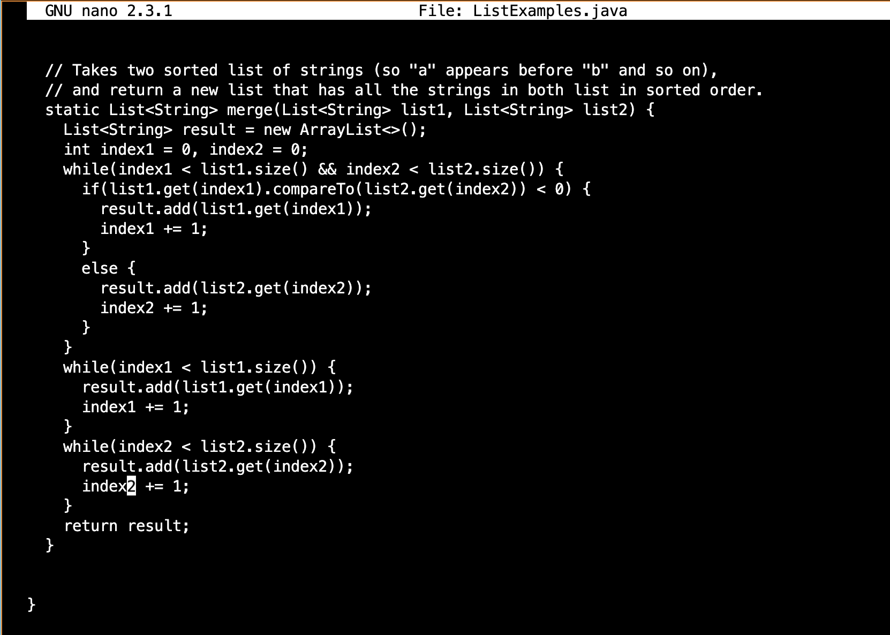
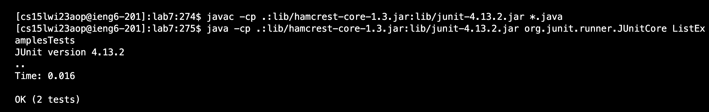

# Step 4:

I used the keyboard shortcuts to type `<Ctrl-R>` and then start typing part of a command, here I used "aop" since this is my distinct account and then I get the whole line I needed to log on to ieng6, `ssh cs15lwi23aop@ieng6.ucsd.edu` showed up, and successfully logged in. Here I don't have to type my password since I have generated SSH Keys for ieng6.
# Step 5:

Here, to clone my fork of the repository from my Github account. First I clicked the button `Open with Github Desktop` and then I copied the address under ssh down so that I could run the command `git clone git@github.com:ChenyuTang98/lab7.git` with the copied address. Here it's ssh address instead of https, becasue of the generated SSH Keys for GitHub. And then I pressed `<Enter` to finish the clone command.
# Step 6:

First I have to change my path to inside the lab7 directory by `cd lab7/`, here I used `<tab> l` and directly get the rest of the command line and pressed `<Enter>`. Then I used `<up><up><up><enter>` to get `javac -cp .:lib/hamcrest-core-1.3.jar:lib/junit-4.13.2.jar *.java`because this ommand was 3 up in the search history, so I used up arrow to access it. And then type `java -cp .:lib/hamcrest-core-1.3.jar:lib/junit-4.13.2.jar org.junit.runner.JUnitCore` to run the java files. Here I used the same `<up><up><up><enter>` to get the command since it's in history. And it shows `FAILURES!!!` which means there's error in our code needed to be fixed.
# Step 7:

To edit the code file to fix the failing test, first I used `nano ListExamples.java` to directly access the java file I want to make changes to. And then by directly replace the `index1 += 1` in the last while loop with `index2 += 1`. In this way, the incremented index is correct when it's all about loop index2 in list2, and thus could end the infinite loop. In order to save the change, I used `<ctrl-o>` to write-out and used `<ctrl-x>` to exit the editing file.
# Step 8:

to run the newly edited file, first i have to compile again. Here I used `<ctrl-R>` and type `javac` and the command `javac -cp .:lib/hamcrest-core-1.3.jar:lib/junit-4.13.2.jar *.java` popped out, so I pressed `<Enter>` to compile. And then I used `<ctrl-R>` and type `java` and the command `java -cp .:lib/hamcrest-core-1.3.jar:lib/junit-4.13.2.jar org.junit.runner.JUnitCore` popped out, so I clicked `<Enter>` to run the java files. And it shows `OK` which means all the testers have passed.
